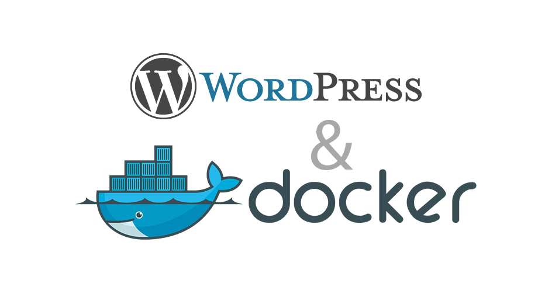

# Custom Project - WordPress Full Code

<p align="center">
  
</p>


## Estrutura de Diretórios

- **wordpress/** → Diferentes versões do WordPress
- **php/** → Múltiplas versões do PHP
- **webserver/** → Suporte a Nginx, Apache, Caddy e OpenLiteSpeed
- **database/** → Bancos de dados MySQL, MariaDB, PostgreSQL, Oracle, SQLite
- **tools/** → Ferramentas adicionais como PhpMyAdmin, PgAdmin e Bitbucket
- **hybrid-folder/** → Pasta para armazenar qualquer outro recurso

## Como Usar

1. Configure o ambiente desejado ajustando o docker-compose.yml
2. Escolha a versão do WordPress e PHP conforme necessidade
3. Execute `docker-compose up -d` para iniciar os containers

# Documentação do Projeto WordPress Full Code com Docker

## Visão Geral
Este projeto fornece um ambiente **altamente modular** e **flexível** para desenvolvimento de múltiplos projetos WordPress com suporte a diferentes versões de PHP, múltiplos bancos de dados e servidores web intercambiáveis.

## Estrutura de Pastas
```
project/
│-- wordpress/
│   │-- v6.5.3/  # Projeto WordPress versão 6.5.3
│   │-- v5.9.3/  # Projeto WordPress versão 5.9.3
│   │-- v4.9.8/  # Projeto WordPress versão 4.9.8
│
│-- custom-project/  # Modelo base de WordPress Full Code
│   │-- wp-admin/
│   │-- wp-content/
│   │   │-- themes/
│   │   │-- plugins/
│   │   │-- uploads/
│   │-- wp-includes/
│   │-- wp-config.php
│   │-- index.php
│
│-- servers/
│   │-- nginx/
│   │   │-- nginx.conf
│   │-- apache/
│   │   │-- httpd.conf
│
│-- databases/
│   │-- mariadb/
│   │   │-- my.cnf
│   │-- postgres/
│   │   │-- postgresql.conf
│   │-- oracle/
│   │   │-- init.ora
│
│-- tools/
│   │-- phpmyadmin/
│   │   │-- config.inc.php
│   │-- pgadmin/
│   │   │-- pgadmin4.conf
│   │-- bitbucket/
│
│-- php/
│   │-- 8.2/
│   │-- 8.1/
│   │-- 8.0/
│   │-- 7.4/
│   │-- 7.0/
│
│-- docker-compose.yml  # Arquivo para orquestração dos containers
```

## Especificações Mínimas e Recomendadas

### **Máquina Local (Desktop/Laptop)**
**Mínimo:**
- Processador: Intel Core i5 de 6ª geração ou AMD equivalente
- RAM: 8GB
- Armazenamento: SSD de 50GB livre
- Sistema Operacional: Windows 10/11, macOS, Linux (Ubuntu/Debian)
- Docker e Docker Compose instalados

**Ótimo:**
- Processador: Intel Core i7 de 10ª geração ou superior / AMD Ryzen 7
- RAM: 16GB ou mais
- Armazenamento: SSD NVMe com pelo menos 100GB livre
- Sistema Operacional: Linux (Ubuntu/Debian) para melhor performance

### **Servidor VPS (Ambiente de Produção ou Staging)**
**Mínimo:**
- CPU: 2 vCPUs
- RAM: 4GB
- Armazenamento: SSD 50GB
- SO: Ubuntu 20.04+ / Debian 11+

**Ótimo:**
- CPU: 4+ vCPUs
- RAM: 8GB+
- Armazenamento: SSD NVMe 100GB+
- SO: Ubuntu 22.04 LTS / Debian 12

## Como Usar

### 1. Configuração Inicial
Certifique-se de ter o Docker e o Docker Compose instalados.

Clone o repositório e acesse o diretório do projeto:
```sh
git clone <repo-url>
cd project
```

### 2. Escolha a Versão do WordPress e PHP
Cada versão do WordPress está em uma pasta específica. Você pode definir qual deseja rodar no `docker-compose.yml`, selecionando a versão correspondente.

Para definir a versão do PHP, ajuste a configuração no `docker-compose.yml` para utilizar o container correto dentro da pasta `php/`.

### 3. Subindo os Containers
Para iniciar o ambiente:
```sh
docker-compose up -d
```
Isso inicializará os serviços conforme definido no `docker-compose.yml`.

### 4. Acesso às Ferramentas
- WordPress: `http://localhost:8000`
- phpMyAdmin: `http://localhost:8080`
- pgAdmin: `http://localhost:5050`
- Bitbucket (se configurado): `http://localhost:7990`

- Nginx:
    - WordPress 6.5.3 → http://localhost:8080
    - WordPress 5.9.3 → http://localhost:8081
    - WordPress 4.9.8 → http://localhost:8082

- Apache:
    - WordPress 6.5.3 → http://localhost:8090
    - WordPress 5.9.3 → http://localhost:8091
    - WordPress 4.9.8 → http://localhost:8092

### 5. Personalização
Edite os arquivos de configuração dentro de `servers/`, `databases/` e `php/` para ajustar conforme sua necessidade.

### 6. Exemplos de Uso

- Para rodar apenas WordPress v6.5.3 com Apache e MariaDB:
```sh
docker-compose up -d wordpress_653 apache db
```

- Para rodar todas as versões do WordPress ao mesmo tempo com Nginx e PostgreSQL:
```sh
docker-compose up -d wordpress_653 wordpress_593 wordpress_498 nginx postgres
```

- MariaDB:
```sh
docker exec -it mariadb mysql -uuser -ppassword -e "SHOW DATABASES;"
```

- PostgreSQL:
```sh
docker exec -it postgres psql -U user -d wordpress_db -c "\l"
```

- Oracle:
```sh
docker exec -it oracle sqlplus wordpress/password@XE
```

- MySQL:
```sh
ddocker exec -it mysql mysql -uuser -ppassword -e "SHOW DATABASES;"
```

- SQLite:
```sh
docker exec -it sqlite sqlite3 /database/database.sqlite "SELECT name FROM sqlite_master WHERE type='table';"
```

- Verificar logs do container:
```sh
docker logs -f NOME_DO_CONTAINER
```

## Contribuição
Se precisar adicionar novos serviços ou ajustes, edite o `docker-compose.yml` e os arquivos de configuração relevantes.

---
Este ambiente foi projetado para máxima flexibilidade e escalabilidade, permitindo desenvolver múltiplos projetos simultaneamente com diferentes versões de WordPress e tecnologias.
